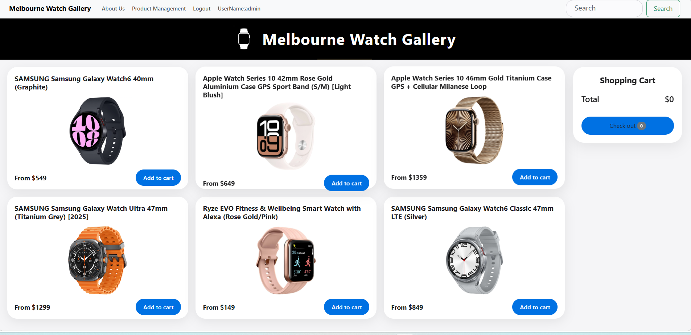
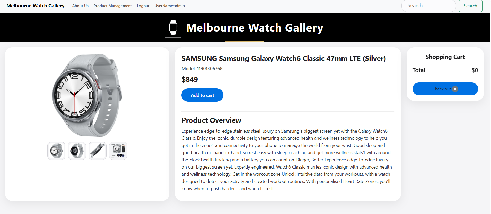
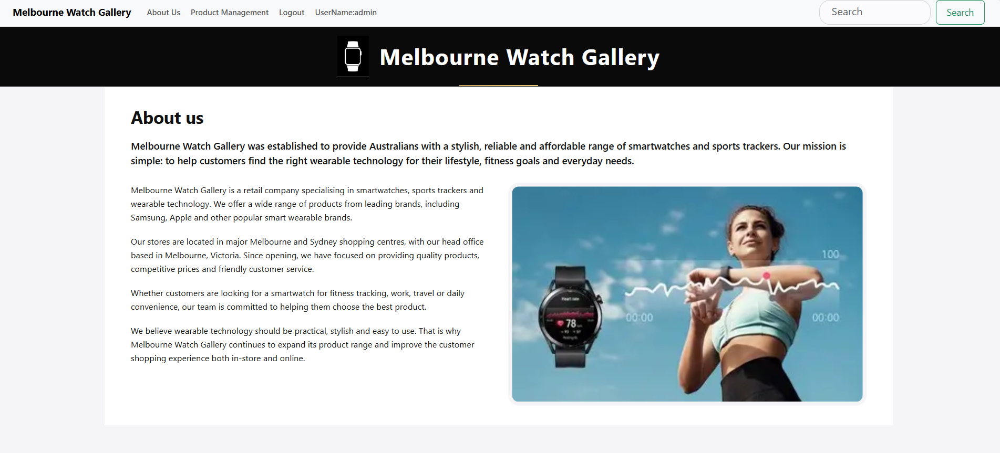
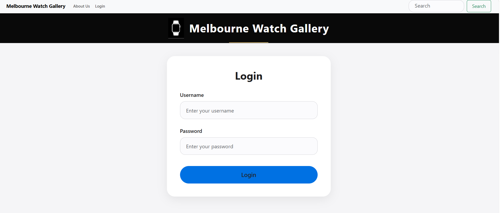
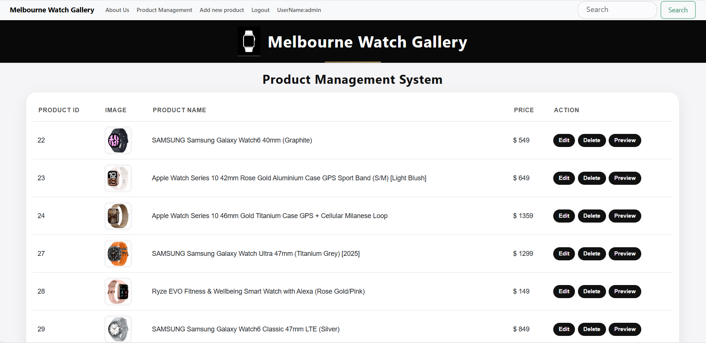
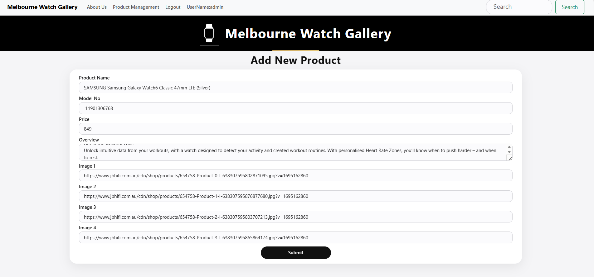
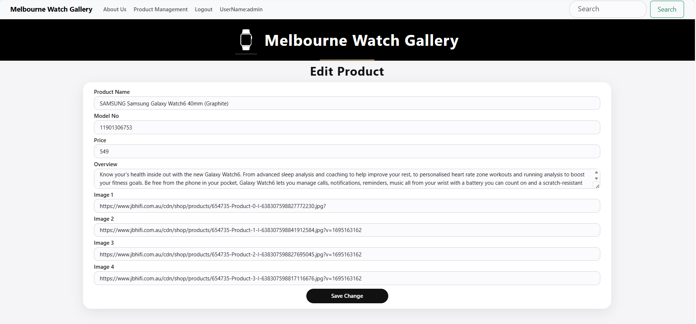
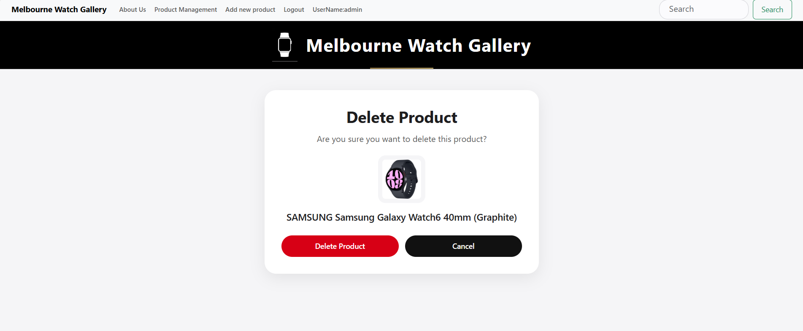
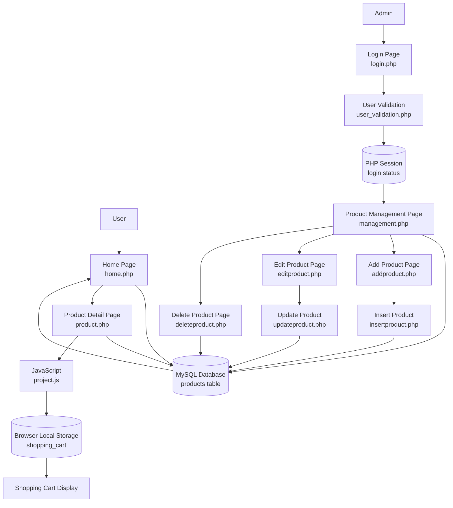

# Melbourne Watch Gallery PHP

A PHP and MySQL e-commerce website for smart watches with admin login and product management.



---

## Project Description

Melbourne Watch Gallery is a responsive e-commerce website developed with PHP and MySQL. The website allows users to browse smartwatch products, view product details, and add products to a shopping cart.

The project also includes an admin product management system. After logging in, the admin can add new products, edit existing product information, and delete products from the database.

This project was created to demonstrate front-end and back-end web development skills, including PHP, MySQL database connection, CRUD operations, session-based login control, JavaScript shopping cart functionality, and responsive web design.

---

## Features

- Responsive e-commerce website layout
- Dynamic product listing from MySQL database
- Product detail page with image gallery
- Shopping cart using browser localStorage
- Admin login system using PHP session
- Product management page
- Add new product function
- Edit product function
- Delete product with confirmation
- Shared navigation bar
- Consistent UI design with one shared CSS file

---

## Technologies Used

### Front-End

- HTML5
- CSS3
- JavaScript
- Bootstrap 5

### Back-End

- PHP
- MySQL

### Development Tools

- XAMPP
- phpMyAdmin
- GitHub

---

## Screenshots

### Home Page


### Product Page



### About Us Page



### Login Page



### Product Management Page



### Add Product Page



### Edit Product Page



### Delete Product Page



### Preview Product Page


---

## System Workflow



---

## Data Flow Description

The website uses PHP to communicate with the MySQL database. Product information is stored in the `products` table and displayed dynamically on the Home page, Product Detail page, and Product Management page.

The admin user can log in through `login.php`. After successful validation, PHP session is used to control access to product management pages.

The shopping cart is handled by JavaScript using browser `localStorage`, allowing users to add and remove products without saving cart data into the database.

---

## Database Tables

The project uses a MySQL database named:

```text
melbourne_watch_gallery
```

Main tables:

```text
products
users
```

### products table

```text
product_id
product_name
model_no
price
overview
image_1
image_2
image_3
image_4
```

### users table

```text
username
password
```

---

## Project Structure

```text
PHP_DB_P_Version/
│
├── README.md
│
├── php/
│   ├── about.php
│   ├── addproduct.php
│   ├── deleteproduct.php
│   ├── editproduct.php
│   ├── home.php
│   ├── insertproduct.php
│   ├── login.php
│   ├── logout.php
│   ├── management.php
│   ├── navbar.php
│   ├── product.php
│   ├── updateproduct.php
│   └── user_validation.php
│
├── config/
│   └── dbconnection.php
│
├── assets/
│   ├── css/
│   │   └── style.css
│   ├── js/
│   │   └── project.js
│   └── screenshots/
│       ├── home.png
│       ├── aboutus.png
│       ├── login.png
│       ├── management.png
│       ├── addproduct.png
│       ├── editproduct.png
│       └── deleteproduct.png
│
└── database/
    └── melbourne_watch_gallery.sql
```

---

## Installation and Setup

To run this project locally, follow the steps below.

### 1. Clone the repository

```bash
git clone https://github.com/evaliu-tech/melbourne-watch-gallery-php.git
```

### 2. Move the project folder to XAMPP htdocs

Example:

```text
C:\xampp\htdocs\PHP_DB_P_Version
```

### 3. Start XAMPP

Start:

```text
Apache
MySQL
```

### 4. Import the database

Open phpMyAdmin:

```text
http://localhost/phpmyadmin
```

Create a database:

```text
melbourne_watch_gallery
```

Import the SQL file from:

```text
database/melbourne_watch_gallery.sql
```

### 5. Check database connection

Open:

```text
config/dbconnection.php
```

Example connection:

```php
<?php
  $servername = "localhost";
  $username = "root";
  $password = "";
  $database = "melbourne_watch_gallery";

  $conn = mysqli_connect($servername,$username,$password,$database);

  if(!$conn){
    die("Connection failed: " . mysqli_connect_error());
  }
?>
```

### 6. Open the project in browser

```text
http://localhost/PHP_DB_P_Version/php/home.php
```

---

## Main Pages

| Page | Description |
|---|---|
| `home.php` | Displays all products from the database |
| `product.php` | Displays selected product details |
| `about.php` | Shows company information |
| `login.php` | Admin login page |
| `management.php` | Product management dashboard |
| `addproduct.php` | Add new product form |
| `editproduct.php` | Edit existing product form |
| `deleteproduct.php` | Delete product confirmation page |

---

## Admin Functions

After logging in, the admin can:

- View all products
- Add new products
- Edit product information
- Delete products
- Access protected management pages through PHP session

---

## Shopping Cart Function

The shopping cart is handled with JavaScript and browser `localStorage`.

Main cart functions:

- Add product to cart
- Remove product from cart
- Display product image, name, and price
- Calculate total price
- Display item count

---

## UI Design Highlights

- Clean and modern layout
- Responsive product grid
- Sticky shopping cart sidebar
- Rounded buttons and input fields
- Consistent header and navigation bar
- Shared `style.css` for all pages
- Product management table with action buttons

---

## Note

This is a PHP and MySQL project. It cannot run directly on GitHub Pages because GitHub Pages only supports static websites.

To run this project, please use XAMPP and import the SQL file from the `database` folder.

---

## Future Improvements

- Add user registration function
- Add checkout and payment function
- Store shopping cart data in MySQL
- Add product image upload function
- Improve search function
- Use prepared statements for better security
- Add admin role management

---

## Project Purpose

This project was created to demonstrate:

- PHP and MySQL integration
- CRUD database operations
- Session-based login control
- JavaScript localStorage shopping cart
- Responsive web design
- Front-end and back-end development workflow

---

## Author

**Eva Liu**

GitHub: [evaliu-tech](https://github.com/evaliu-tech)
